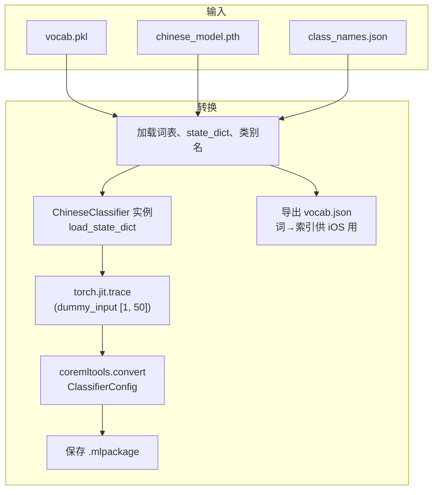

# Python 模型训练流程与数据流向

基于本项目 `AIModelTrain/classify_quality` 等训练脚本整理。

---

## 一、训练流程总览

```mermaid
flowchart TB
    subgraph 输入
        A[data.csv<br/>label, text]
    end

    subgraph 数据准备
        B[读取 CSV]
        C[清洗: dropna<br/>label → label_id]
        D[raw_train_data<br/>列表: (label_id, text)]
        E[ChineseVocab 构建词表<br/>jieba 分词 + 词频统计]
        F[保存 vocab.pkl<br/>class_names.json]
    end

    subgraph 数据集与加载
        G[SimpleDataset<br/>vocab.encode 文本→ID序列]
        H[DataLoader<br/>batch_size=8, shuffle]
        I[collate_fn<br/>padding/截断至 MAX_LEN=50]
    end

    subgraph 模型与训练
        J[ChineseClassifier<br/>Embedding→MeanPool→Linear]
        K[CrossEntropyLoss<br/>Adam lr=0.001]
        L[训练循环 20 epochs<br/>forward→loss→backward→step]
    end

    subgraph 输出
        M[chinese_model.pth<br/>state_dict]
    end

    A --> B --> C --> D --> E --> F
    D --> G
    E --> G
    G --> H --> I
    I --> L
    J --> L
    K --> L
    L --> M
```

---

## 二、数据流向详图

```mermaid
flowchart LR
    subgraph 原始数据
        CSV["data.csv\n(label, text)"]
    end

    subgraph 预处理
        DF["DataFrame\npandas"]
        CLEAN["dropna\nlabel→label_id"]
        RAW["raw_train_data\n[(0/1/2/3, \"句子\"), ...]"]
    end

    subgraph 词表
        NORM["_normalize_text\n去标点/空白"]
        JIEBA["jieba.cut\n分词"]
        COUNTER["Counter\n词频"]
        STOI["stoi / itos\n词↔索引"]
        VOCAB["vocab.pkl\nChineseVocab"]
    end

    subgraph 序列化
        ENCODE["vocab.encode\n文本→[id1, id2, ...]"]
        PAD["padding/截断\n→ 长度 50"]
        BATCH["Batch\nlabels: [B], texts: [B, 50]"]
    end

    subgraph 模型前向
        EMB["Embedding\n[B,50]→[B,50,64]"]
        MASK["mask 非 PAD"]
        POOL["mean pooling\n→ [B, 64]"]
        FC["Linear\n→ [B, num_class]"]
        LOGITS["logits"]
    end

    subgraph 损失与反传
        LOSS["CrossEntropyLoss\n(logits, label)"]
        BACK["loss.backward()"]
        STEP["optimizer.step()"]
    end

    CSV --> DF --> CLEAN --> RAW
    RAW --> NORM --> JIEBA --> COUNTER --> STOI --> VOCAB
    RAW --> ENCODE
    VOCAB --> ENCODE
    ENCODE --> PAD --> BATCH
    BATCH --> EMB --> MASK --> POOL --> FC --> LOGITS
    LOGITS --> LOSS --> BACK --> STEP
```

---

## 三、训练阶段数据形状变化

| 阶段           | 数据/变量     | 形状或格式说明 |
|----------------|----------------|----------------|
| 原始           | data.csv       | 列: `label`, `text` |
| 清洗后         | raw_train_data | `[(label_id: int, text: str), ...]` |
| 词表           | vocab.stoi     | `{ "<unk>": 0, "<pad>": 1, "词": 2, ... }` |
| 单条编码       | vocab.encode(text) | `[id1, id2, ...]` 长度不定 |
| collate 后     | batch          | `labels`: [B], `texts`: [B, 50] |
| Embedding 后   | embedded       | [B, 50, embed_dim] |
| 池化后         | pooled         | [B, embed_dim] |
| 输出           | logits         | [B, num_class] |

---

## 四、转 Core ML 流程（训练之后）



---

## 五、简要步骤对照

1. **读数据**：`data.csv` → DataFrame → 去空、label 映射为 ID → `raw_train_data`  
2. **建词表**：`ChineseVocab(raw_train_data)`：分词、归一化、词频、建 stoi/itos → 存 `vocab.pkl`  
3. **数据集**：`SimpleDataset` 每次返回 `(label, vocab.encode(text))`  
4. **DataLoader**：`collate_fn` 将不等长序列 pad/截断为 50  
5. **训练**：batch 上 device → `model(text)` → loss → backward → step，重复 20 个 epoch  
6. **保存**：`torch.save(model.state_dict(), chinese_model.pth)`  
7. **转 Core ML**：加载 pth + vocab + 类别名 → trace → coremltools → mlpackage + vocab.json  

以上流程图与表格可直接在支持 Mermaid 的 Markdown 预览中查看（如 VS Code、GitHub、Cursor）。
